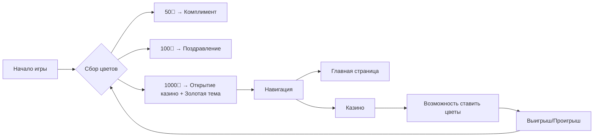

# 🌸 Интерактивная открытка к 8 марта / Interactive March 8 Greeting Card

<div align="center">


**✨ Уникальная веб-открытка с мини-играми, коллекцией тем и системой прогрессии ✨**

[🇷🇺 Русская версия](#-русская-версия) • [🇬🇧 English version](#-english-version) • [🎮 Демо](#-демо) • [📦 Установка](#-установка)

---

*🎉 **Важно:** Проект создан как творческий эксперимент и не предназначен для реальных азартных игр. Все игровые механики — исключительно развлекательный контент к празднику.* 🎉

</div>

---

## 📋 Содержание / Table of Contents
- [🌸 Русская версия](#-русская-версия)
  - [📝 Описание проекта](#-описание-проекта)
  - [✨ Ключевые возможности](#-ключевые-возможности)
  - [🎮 Мини-игры](#-мини-игры)
  - [🎨 Темы оформления](#-темы-оформления)
  - [🔑 Промокоды и секреты](#-промокоды-и-секреты)
  - [📊 Система прогрессии](#-система-прогрессии)
  - [📁 Структура проекта](#-структура-проекта)
  - [🛠 Технологии](#-технологии)
- [🇬🇧 English version](#-english-version)
  - [📝 Project Description](#-project-description)
  - [✨ Key Features](#-key-features)
  - [🎮 Mini-games](#-mini-games)
  - [🎨 Color Themes](#-color-themes)
  - [🔑 Promo Codes & Secrets](#-promo-codes--secrets)
  - [📊 Progression System](#-progression-system)
  - [📁 Project Structure](#-project-structure)
  - [🛠 Technologies](#-technologies)
- [🚀 Установка и запуск / Installation](#-установка-и-запуск--installation)
- [👥 Команда проекта / Team](#-команда-проекта--team)
- [📜 Лицензия / License](#-лицензия--license)

---

## 🌸 Русская версия

### 📝 Описание проекта
**Интерактивная открытка к 8 марта** — это не просто статичное поздравление, а полноценное веб-приложение с игровыми механиками. Вместо обычной картинки пользователь получает возможность взаимодействовать с контентом: собирать виртуальные цветы, открывать новые темы оформления, играть в мини-игры и читать персонализированные поздравления.

Проект создан с душой и вниманием к деталям: каждая мелочь, от анимации лепестков до цветопада, призвана создать праздничное настроение.

### ✨ Ключевые возможности

| Категория | Функция | Описание |
|-----------|---------|----------|
| 🎨 **Интерфейс** | Адаптивный дизайн | Полная поддержка мобильных устройств, планшетов и десктопов |
| | PWA-подобный опыт | Работает офлайн после загрузки, сохраняет прогресс |
| | Кастомные модалки | 10+ типов модальных окон с уникальным дизайном |
| 🎮 **Геймплей** | Кликер-механика | Сбор цветов нажатием на большой цветок |
| | Система уровней | Каждые 100 цветов — особое поздравление |
| | Комплименты | Случайные комплименты каждые 50 цветов |
| 💾 **Сохранения** | LocalStorage | Автоматическое сохранение прогресса |
| | Синхронизация | Сохраняются цветы, открытые темы, использованные промокоды |
| 🎯 **Разблокировки** | Прогрессивное открытие | Новый контент доступен при достижении целей |
| | Секретные темы | 3 скрытые темы, открываемые через прогресс или промокоды |

### 🎮 Мини-игры

#### Сравнительная таблица мини-игр

| Характеристика | 🌼 Гадание на ромашке | 🎰 Казино "Букет" | 🎡 Колесо удачи |
|----------------|----------------------|-------------------|-----------------|
| **Стоимость** | 10🌸 | Бесплатно (казино) / 10🌸 (вращение) | 10🌸 |
| **Механика** | Отрывание лепестков | Ставки на множители | Случайный цветок |
| **Награда** | Предсказания | x0, x0.1, x1.5, x2, x5, x11 | Эмодзи цветка |
| **Особенности** | Анимация вращения | 8 секторов с разными множителями | 8 видов цветов |
| **Визуализация** | CSS-ромашка | Canvas-колесо | Canvas-колесо |
| **Уровень сложности** | 🟢 Простая | 🔴 Азартная | 🟡 Случайная |

#### Детальное описание

**🌼 Гадание на ромашке**
- От 9 до 12 лепестков на цветке
- 6 вариантов предсказаний
- При отрыве последнего лепестка — финальное предсказание
- Возможность "перегадать" (кнопка "Гадать")
- Анимация вращения при перегадывании

**🎰 Казино "Букет"**
- Система ставок с полем ввода
- Кнопка "Макс" для максимальной ставки
- 8 секторов с множителями: 0, 0, 0.1, 0.1, 1.5, 2, 5, 11
- Физика вращения с затуханием
- Результат показывается в модальном окне
- Цветопад при выигрыше

**🎡 Колесо удачи**
- 8 секторов с цветами: сакура, ромашка, подсолнух, гибискус, тюльпан, роза, сакура (дубль), веточка
- Названия цветов с заглавной буквы
- При выпадении — ливень из соответствующего цветка
- Простая механика без ставок

### 🎨 Темы оформления

| Тема | Класс | Цветовая схема | Статус | Градиент |
|------|-------|----------------|--------|----------|
| **Розовая** | `theme-default` | Розово-персиковая | 🔓 По умолчанию | `#fef3f8 → #ffeef4` |
| **Белая** | `theme-white` | Монохромная светлая | 🔓 По умолчанию | `#ffffff → #f5f5f5` |
| **Сиреневая** | `theme-lilac` | Лавандово-сиреневая | 🔓 По умолчанию | `#f3e5f5 → #e1bee7` |
| **Ярко-розовая** | `theme-bright-pink` | Насыщенно-розовая | 🔓 По умолчанию | `#ffd0dd → #ffb0c5` |
| **Золотая** | `theme-gold` | Золотисто-медовая | 🔐 1000🌸 | `#fbf3e0 → #f5d0a0` |
| **Космическая** | `theme-cosmic` | Фиолетово-космическая | 🔐 Промокод `505` | `#0a0f1e → #2a1f4a` |
| **Тёмно-синяя** | `theme-dark-blue` | Глубокий синий | 🔐 Промокод `1337` | `#0a1a2a → #0a1f4a` |

### 🔑 Промокоды и секреты

| Промокод | Эффект | Тип |
|----------|--------|-----|
| `1488` | 🚫 Сброс прогресса (анти-нацистское послание) | Штрафной |
| `52` | 🏛️ +5200 цветов (Санкт-Петербург) | Бонусный |
| `67` | 😕 +1 цветок (шутка) | Шуточный |
| `69` | 😏 +690 цветов | Шуточный |
| `1337` | 👾 +133700 цветов + тёмно-синяя тема | Секретный |
| `505` | 🌟 +505812 цветов + космическая тема | Секретный |
| `МЫВАСЛЮБИМ` | 💖 +1 млрд цветов | Пасхалка |

### 📊 Система прогрессии



### 📁 Структура проекта

```
📦 march8-greeting
├── 📄 index.html                          # Главный файл (все компоненты)
├── 📁 themes/
│   ├── 🎨 base.css                         # Базовая стилизация
│   └── 🎨 themes.css                        # CSS-переменные всех тем
├── 📁 mini_games/
│   ├── 🎰 casino.html                       # Казино с множителями
│   ├── 🌼 chamomile.html                     # Гадание на ромашке
│   └── 🎡 bouquet.html                       # Колесо удачи
└── 📄 README.md                            # Документация
```

### 🛠 Технологии

| Технология | Применение |
|------------|------------|
| **HTML5** | Структура страниц, семантическая разметка |
| **CSS3** | Стилизация, анимации, медиа-запросы, CSS-переменные |
| **JavaScript (ES6+)** | Логика игр, обработка событий, LocalStorage |
| **Canvas API** | Отрисовка колёс рулетки |
| **LocalStorage** | Сохранение прогресса пользователя |
| **Flexbox/Grid** | Адаптивная вёрстка |
| **CSS-переменные** | Динамическая смена тем |

---

## 🇬🇧 English version

### 📝 Project Description
**Interactive March 8 Greeting Card** is not just a static greeting, but a full-featured web application with game mechanics. Instead of a regular picture, the user gets an opportunity to interact with the content: collect virtual flowers, unlock new design themes, play mini-games, and read personalized congratulations.

The project is crafted with soul and attention to detail — every little thing, from petal animation to flower rain, is designed to create a festive mood.

### ✨ Key Features

| Category | Feature | Description |
|----------|---------|-------------|
| 🎨 **Interface** | Responsive Design | Full support for mobile, tablet, and desktop |
| | PWA-like experience | Works offline after loading, saves progress |
| | Custom modals | 10+ modal window types with unique design |
| 🎮 **Gameplay** | Clicker mechanic | Collect flowers by tapping the big flower |
| | Level system | Every 100 flowers — special greeting |
| | Compliments | Random compliments every 50 flowers |
| 💾 **Saves** | LocalStorage | Automatic progress saving |
| | Synchronization | Saves flowers, unlocked themes, used promo codes |
| 🎯 **Unlockables** | Progressive unlocking | New content available upon reaching goals |
| | Secret themes | 3 hidden themes unlocked via progress or promo codes |

### 🎮 Mini-games

#### Mini-games Comparison Table

| Feature | 🌼 Daisy Fortune | 🎰 "Bouquet" Casino | 🎡 Wheel of Fortune |
|---------|-----------------|---------------------|---------------------|
| **Cost** | 10🌸 | Free (casino) / 10🌸 (spin) | 10🌸 |
| **Mechanic** | Petal plucking | Bets on multipliers | Random flower |
| **Reward** | Predictions | x0, x0.1, x1.5, x2, x5, x11 | Flower emoji |
| **Features** | Spin animation | 8 sectors with different multipliers | 8 flower types |
| **Visualization** | CSS daisy | Canvas wheel | Canvas wheel |
| **Difficulty** | 🟢 Easy | 🔴 Gambling | 🟡 Random |

### 🎨 Color Themes

| Theme | Class | Color Scheme | Status | Gradient |
|-------|-------|--------------|--------|----------|
| **Pink** | `theme-default` | Pink-peach | 🔓 Default | `#fef3f8 → #ffeef4` |
| **White** | `theme-white` | Monochrome light | 🔓 Default | `#ffffff → #f5f5f5` |
| **Lilac** | `theme-lilac` | Lavender-lilac | 🔓 Default | `#f3e5f5 → #e1bee7` |
| **Bright Pink** | `theme-bright-pink` | Saturated pink | 🔓 Default | `#ffd0dd → #ffb0c5` |
| **Gold** | `theme-gold` | Golden-honey | 🔐 1000🌸 | `#fbf3e0 → #f5d0a0` |
| **Cosmic** | `theme-cosmic` | Purple cosmic | 🔐 Promo code `505` | `#0a0f1e → #2a1f4a` |
| **Dark Blue** | `theme-dark-blue` | Deep blue | 🔐 Promo code `1337` | `#0a1a2a → #0a1f4a` |

### 🔑 Promo Codes & Secrets

| Promo Code | Effect | Type |
|------------|--------|------|
| `1488` | 🚫 Progress reset (anti-Nazi message) | Penalty |
| `52` | 🏛️ +5200 flowers (St. Petersburg) | Bonus |
| `67` | 😕 +1 flower (joke) | Joke |
| `69` | 😏 +690 flowers | Joke |
| `1337` | 👾 +133700 flowers + dark blue theme | Secret |
| `505` | 🌟 +505812 flowers + cosmic theme | Secret |
| `МЫВАСЛЮБИМ` | 💖 +1 billion flowers | Easter egg |

### 📁 Project Structure

```
📦 march8-greeting
├── 📄 index.html                          # Main file (all components)
├── 📁 themes/
│   ├── 🎨 base.css                         # Base styling
│   └── 🎨 themes.css                        # CSS variables for all themes
├── 📁 mini_games/
│   ├── 🎰 casino.html                       # Casino with multipliers
│   ├── 🌼 chamomile.html                     # Daisy fortune telling
│   └── 🎡 bouquet.html                       # Wheel of fortune
└── 📄 README.md                            # Documentation
```

### 🛠 Technologies

| Technology | Application |
|------------|-------------|
| **HTML5** | Page structure, semantic markup |
| **CSS3** | Styling, animations, media queries, CSS variables |
| **JavaScript (ES6+)** | Game logic, event handling, LocalStorage |
| **Canvas API** | Roulette wheel rendering |
| **LocalStorage** | User progress saving |
| **Flexbox/Grid** | Responsive layout |
| **CSS variables** | Dynamic theme switching |

---

## 🚀 Установка и запуск / Installation

### Простой способ / Simple way
1. Скачайте все файлы репозитория / Download all repository files
2. Откройте `index.html` в любом современном браузере / Open `index.html` in any modern browser

### С помощью Git / Using Git
```bash
git clone https://github.com/yourusername/march8-greeting.git
cd march8-greeting
# Откройте index.html в браузере / Open index.html in browser
```

### Требования / Requirements
- Любой современный браузер (Chrome, Firefox, Safari, Edge) / Any modern browser
- Включенный JavaScript / JavaScript enabled
- Поддержка LocalStorage / LocalStorage support

---

## 👥 Команда проекта / Team

| Роль / Role | Имя / Name | Контакт / Contact |
|-------------|------------|-------------------|
| 👨‍💻 **Автор / Author** | Aizen | [@su57ks](https://t.me/su57ks) |
| 💡 **Идеи / Ideas** | selyswag | [@selyswag](https://t.me/selyswag) |
| 🧪 **Тестирование / Testing** | Ярослава | — |
| 🙏 **Благодарности / Special thanks** | Егору Е. и Денису С. / Egor E. and Denis S. | — |

---

## 📜 Лицензия / License

Проект распространяется под лицензией MIT. Подробнее в файле `LICENSE`.

This project is licensed under the MIT License. See the `LICENSE` file for details.

---

<div align="center">

**Сделано с любовью к празднику и вниманием к деталям** 💗

*Если вам понравился проект — поставьте звезду на GitHub! ⭐*

[⬆ Наверх / Back to top](#-интерактивная-открытка-к-8-марта--interactive-march-8-greeting-card)

</div>
